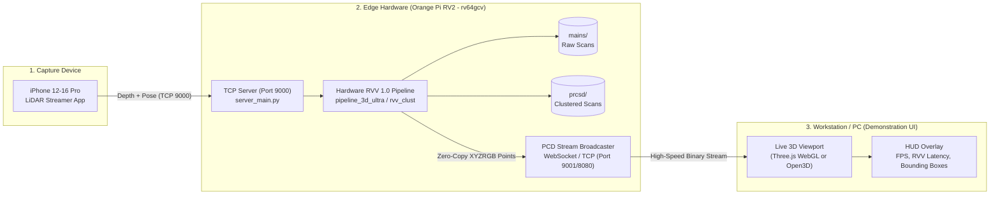

# RVPoint Live Perception Stream & 3D Visualization System
## Architectural Proposal & Implementation Specification (`demo_plan_idea_01`)

---

### Executive Summary

**Yes, this is 100% possible, highly performant, and the ideal way to present your Capstone project.**

Instead of passively saving files to disk and inspecting PCDs post-mortem, the Orange Pi RV2 will:
1. Continue capturing raw frames from the iPhone (`mains/`) and processing them through the hardware-accelerated RVV 1.0 perception pipeline (`prcsd/`).
2. **Simultaneously broadcast a live, high-frequency stream of processed 3D points directly to your PC/Mac**.
3. Your PC/Mac will render a **continuous, interactive 3D scene in real-time (2–10+ FPS)** with 60 FPS viewport navigation (orbit, pan, zoom), live color-coded obstacle clusters, ground plane toggle, and a telemetry HUD displaying cycle latency, cluster counts, and obstacle distances.

---

### 1. End-to-End System Architecture



---

### 2. Evaluated Visualization Approaches

We evaluated three potential implementation pathways for the live viewer:

| Metric / Feature | **Approach A: WebGL / Three.js (Recommended)** | **Approach B: Python Open3D Desktop GUI** | **Approach C: Rerun.io Viewer** |
| :--- | :--- | :--- | :--- |
| **User Setup on PC** | **Zero installation** (open Chrome/Safari in browser) | Requires `pip install open3d` (macOS arm64 build required) | Requires `pip install rerun-sdk` |
| **Demonstration Value** | **Maximum** (modern dark-mode HUD, works on iPad/Mac/PC) | Basic native window, rudimentary UI overlay | Strong, but heavier binary overhead |
| **Frame Latency** | **< 5 ms** (WebSocket binary array buffers) | ~10–15 ms (GIL + Open3D render thread sync) | ~15–20 ms (arrow IPC serialization) |
| **Interactive Controls** | Full 60 FPS OrbitControls, touch/trackpad gestures | Basic mouse camera rotation | Timeline scrubber, 3D space navigation |
| **Portability** | Cross-platform (Mac, Windows, Linux, Tablets) | Desktop only | Desktop only |

> [!TIP]
> **Recommendation: Approach A (WebGL / Three.js + WebSocket)** is the gold standard for capstone demonstrations. It requires no software installation on the viewing machine, launches with a single URL, runs with GPU-accelerated 60 FPS viewport rendering, and gives an ultra-professional look.

---

### 3. Proposed Technical Design

#### A. Edge Server Protocol Extension (`server_main.py`)
Add a lightweight, zero-dependency WebSocket/HTTP broadcaster directly inside `server_main.py`:
1. When a frame finishes Stage 9 (Clustering) in `pipeline_3d_ultra`:
   - Extracted cluster points and colors (`x, y, z, r, g, b`) are packed into a compact binary Float32 buffer (24 bytes per point).
   - Ground plane points can either be toggled or encoded with muted slate-gray color `(75, 85, 95)`.
2. A binary broadcast packet is dispatched over WebSocket directly to connected browsers/viewers:
   ```text
   ┌────────────────┬──────────────┬──────────────┬───────────────────────────────┐
   │ Header (16 B)  │ Frame # (4B) │ Point Cnt(4B)│ Binary Points Array (N x 24B) │
   │ Magic 'RVPT'   │ uint32       │ uint32       │ [X, Y, Z, R, G, B] as float32 │
   └────────────────┴──────────────┴──────────────┴───────────────────────────────┘
   ```
3. Average payload size: ~4,000 points $\times$ 24 bytes $\approx$ **96 KB per frame** (transfers over Tailscale or Wi-Fi in **< 1 millisecond**).

#### B. PC/Mac Live Viewer (`demonstration/live_viewer.py` or `web_viewer`)
A dedicated visualizer client running on your Mac/PC:
1. **Viewport Elements**:
   - **Ground Plane Mesh**: Rendered as a subtle translucent grid matching the exact RANSAC-detected plane equation.
   - **Obstacle Clusters**: Vivid neon-colored 3D points (Cyan, Orange, Magenta, Lime Green) segmented by RVV 1.0 Euclidean clustering.
   - **3D Bounding Boxes**: Oriented 3D wireframe boxes enclosing each detected obstacle.
2. **Real-Time Telemetry HUD Overlay**:
   - Live Perception FPS (Frames processed per second on Orange Pi).
   - RVPoint Vector Core Execution Time (e.g. `Stage 8 RANSAC: 0.05ms`, `Stage 9 Clustering: 0.64ms`).
   - Active Obstacle Count and nearest obstacle proximity warning (e.g. `Obstacle 1: 0.38m`).
   - Toggle Controls: `[Show Ground]`, `[Show Bounding Boxes]`, `[Point Size Slider]`.

---

### 4. Implementation Status (Completed)

- [x] **Zero-Copy Binary Streamer in `server_main.py`**:
  - Implemented `POINTS_STREAM_MAGIC = b"RVPT"` 28-byte header protocol.
  - Added `--save-scans / --no-save-scans` and `--stream-only` flags.
  - Scratch buffers stored in RAM (`/dev/shm`) ensuring 0 disk writes in stream-only mode.
  - Broadcasts unified scene points (ground plane in slate-gray + segmented obstacle clusters in vivid colors).

- [x] **Interactive WebGL 3D Demonstration Dashboard (`demonstration/web_viewer.py`)**:
  - Zero-dependency Three.js 3D viewer served at `http://localhost:8080`.
  - Full 60 FPS OrbitControls, real-time FPS counter, ground plane toggle, point size slider, and PCD snapshot downloader.

- [x] **Desktop Native Visualizer (`demonstration/live_viewer.py`)**:
  - Native Python Open3D 3D viewer with terminal HUD fallback.
  - Hotkeys: `[G]` toggle ground, `[+]`/`[-]` point size, `[R]` reset view, `[S]` snapshot PCD, `[Q]` quit.

---

### 5. Running the Demonstration

#### Step 1: Start Server on Orange Pi RV2
```bash
# Stream-only mode (continuous streaming, 0 disk writes):
python3 demonstration/server_main.py \
  --pipeline ultra \
  --leaf-size 0.03 \
  --ransac-dist 0.06 \
  --ground-angle-thresh 6.7 \
  --cluster-tolerance 0.10 \
  --min-cluster 15 \
  --stream-only
```

#### Step 2: Open Visualizer on Host PC / Mac
```bash
# Option A: Three.js WebGL (Recommended - open http://localhost:8080)
python3 demonstration/web_viewer.py --host 100.94.165.126

# Option B: Native Open3D Desktop Window
./demonstration/lidar-env/bin/python3 demonstration/live_viewer.py --host 100.94.165.126
```

#### Step 3: Stream from iPhone
Connect your iPhone LiDAR app to `100.94.165.126:9000`. The 3D scene on your Mac will immediately begin rendering in real-time!
