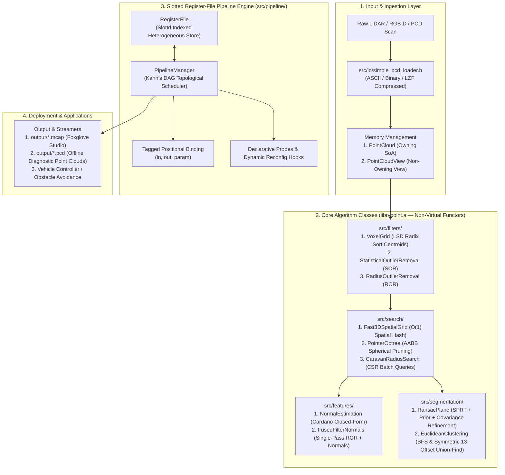

# RVPoint Architecture Specification

> **Version**: 2.0.0 (Redesign Specification)
> **Status**: Official System Architecture Reference
> **Primary Namespace**: `rvpoint` (forwarder alias: `rvv_pcl`)
> **Target Architecture**: RISC-V 64-bit with RVV 1.0 Vector Extension (`rv64gcv`, VLEN=128)
> **Target SoC Reference**: SpacemiT K1 Octa-Core RISC-V SoC (Dual 4-Core Clusters)

---

## 1. Executive Overview

**RVPoint** is a high-performance, zero-dependency C++17 point cloud perception library purpose-built for **RISC-V architectures with Vector Extensions (RVV 1.0)**. It delivers drop-in, hardware-accelerated replacements for Point Cloud Library (PCL) algorithms across autonomous driving (LiDAR), mobile robotics, and embedded edge perception.

The codebase is built on four core architectural pillars:
1. **Contiguous Structure-of-Arrays (SoA)**: Data layouts engineered for max-width vector loads (`__riscv_vle32_v_f32m8`, LMUL=8) without strided gather overhead.
2. **Zero-Vtable Non-Virtual Functor Architecture (ADR-0011)**: Every algorithm is a self-contained, stateful C++ class with value semantics, zero vtable pointers, deterministic inlining, and stage-owned scratch buffers.
3. **Zero-Heap Steady-State Execution Invariant (ADR-0010)**: All working memory is pre-allocated during initial setup (`reserve(max_points)`), eliminating per-frame `malloc`/`free` churn and cache thrashing on the perception hot path.
4. **Slotted Register-File Pipeline & PipelineManager (ADR-0012)**: Type-erased, zero-overhead slot indexing with Kahn's DAG topological dependency resolution, tagged positional binding, declarative probes, and lock-free dynamic parameter reconfiguration.

---

## 2. System Architecture Diagram



---

## 3. Data Representation & Memory Layout

### 3.1 Structure-of-Arrays (SoA) vs. Array-of-Structures (AoS)

Standard PCL relies on Array-of-Structures (`std::vector<PointXYZ>`), producing interleaved coordinates (`X Y Z _ X Y Z _`). On SIMD and vector hardware, loading interleaved coordinates demands strided loads or expensive cross-lane shuffles.

RVPoint enforces **Structure-of-Arrays (SoA)** across all vector hot paths:

```cpp
namespace rvpoint {

// Non-owning read-only view into contiguous coordinate buffers
struct PointCloudView {
  const float* x = nullptr;
  const float* y = nullptr;
  const float* z = nullptr;
  std::size_t n = 0;
};

// Owning point cloud container managing contiguous memory
struct PointCloud {
  std::vector<float> x;
  std::vector<float> y;
  std::vector<float> z;
  std::size_t n = 0;

  PointCloudView view() const noexcept;
  void reserve(std::size_t count);
  void resize(std::size_t count);
  void clear() noexcept;
};

} // namespace rvpoint
```

#### Vector Unit-Stride Efficiency
- Coordinate buffers `x`, `y`, `z` are flat and memory-aligned.
- Sequential vector loads stream data directly into register groups:
  ```c
  size_t vl = __riscv_vsetvl_e32m8(n - i);
  vfloat32m8_t vx = __riscv_vle32_v_f32m8(&cloud.x[i], vl);
  vfloat32m8_t vy = __riscv_vle32_v_f32m8(&cloud.y[i], vl);
  vfloat32m8_t vz = __riscv_vle32_v_f32m8(&cloud.z[i], vl);
  ```
- Yields maximal hardware memory bandwidth utilization with zero strided gather penalties.

### 3.2 Domain-Specific Models
- **`PlaneModel`**: Encapsulates 3D planar coefficients $ax + by + cz + d = 0$, inlier count, signed distance evaluation, and unit normalization.
- **`ClusterResult`**: Flat Compressed Sparse Row (CSR) cluster representation. Stores concatenated `indices` and `offsets` (cluster $k$ spans `offsets[k]` to `offsets[k+1]`), completely eliminating nested `std::vector<std::vector<int>>` heap churn.

---

## 4. Core Algorithm Library (`src/`)

Every algorithm in `src/` is a stateful, non-virtual C++ class with value semantics implementing the **Functor Protocol** (`operator()`).

### 4.1 Filters (`src/filters/`)
* **`VoxelGrid`** ([`voxel_grid.h`](../src/filters/voxel_grid.h), [`voxel_grid_downsamp.cpp`](../src/filters/voxel_grid_downsamp.cpp)):
  - 1D linearized Morton/spatial hash discretization.
  - Linear-time $O(N)$ LSD Radix Sort (`radix_sort.h`) replacing $O(N \log N)$ comparison sorting.
  - Contiguous centroid reduction utilizing vector accumulation.
* **`StatisticalOutlierRemoval`** ([`statistical_outlier_removal.h`](../src/filters/statistical_outlier_removal.h), [`statistical_outlier_removal.cpp`](../src/filters/statistical_outlier_removal.cpp)):
  - $k$-NN distance computation and single-pass mean/variance vector calculation.
  - Classifies inliers via vector thresholding: $d_i \le \mu + \alpha \cdot \sigma$.
* **`RadiusOutlierRemoval`** ([`radius_outlier_removal.h`](../src/filters/radius_outlier_removal.h), [`radius_outlier_removal.cpp`](../src/filters/radius_outlier_removal.cpp)):
  - Removes points with fewer than $K$ neighbors within Euclidean ball radius $R$.
  - Accelerated via internal `Fast3DSpatialGrid` with self-cell fastpath.
* **Concept Compliance**: Satisfies `PointCloudFilter` via [`filter_concept.h`](../src/filters/filter_concept.h).

### 4.2 Spatial Indexing & Nearest Neighbors (`src/search/`)
* **`Fast3DSpatialGrid`** ([`fast_3d_spatial_grid.h`](../src/search/fast_3d_spatial_grid.h), [`fast_3d_spatial_grid.cpp`](../src/search/fast_3d_spatial_grid.cpp)):
  - Flat, power-of-two open-addressing hash table with linear probing.
  - $O(N)$ table reset using `touched_slots_` array, avoiding multi-megabyte `memset` clearing.
  - Self-cell query fastpath skipping 26 neighbor lookups for dense interior voxels.
* **`PointerOctree`** ([`pointer_octree.h`](../src/search/pointer_octree.h), [`pointer_octree.cpp`](../src/search/pointer_octree.cpp)):
  - Hierarchical bounding-box tree storing tight Axis-Aligned Bounding Boxes (AABB).
  - Sphere-box overlap pruning for radius queries (`RadiusSearchable`).
  - Branch-and-bound bounding-box distance pruning for $k$-NN queries (`KNNSearchable`).
* **`CaravanRadiusSearch`** ([`caravan_radius_search.h`](../src/search/caravan_radius_search.h)):
  - Caravan batch query executor that traverses octrees for groups of query points simultaneously.
* **Concepts**: Formalized in [`search_concepts.h`](../src/search/search_concepts.h) (`RadiusSearchable` vs. `KNNSearchable`).

### 4.3 Features (`src/features/`)
* **`NormalEstimation`** ([`normal_estimation.h`](../src/features/normal_estimation.h), [`normal_estimation.cpp`](../src/features/normal_estimation.cpp)):
  - **Spatial Hashing Acceleration**: Built on `Fast3DSpatialGrid` neighbor queries.
  - **Cardano Closed-Form Solver**: Solves the characteristic cubic polynomial $\det(\mathbf{C} - \lambda \mathbf{I}) = 0$ in closed form using analytical trigonometric equations:
    $$\lambda_3 = 2 \sqrt{-p/3} \cos\left(\frac{\theta + 4\pi}{3}\right) - \frac{a}{3}$$
    Eliminates iterative Jacobi rotations, delivering **$>4\times$** acceleration over classical eigensolvers.
  - **Viewpoint Reorientation**: Vectorized dot-product test ensuring normals orient towards the sensor origin.
* **`FusedFilterNormals`** ([`fused_filter_normals.h`](../src/features/fused_filter_normals.h), [`fused_filter_normals.cpp`](../src/features/fused_filter_normals.cpp)):
  - Single-pass algorithmic fusion executing Radius Outlier Removal (ROR) and Cardano surface normal estimation simultaneously.
  - Completely avoids a second grid construction pass and redundant neighbor queries.

### 4.4 Segmentation (`src/segmentation/`)
* **`RansacPlane`** ([`ransac_plane.h`](../src/segmentation/ransac_plane.h), [`ransac_plane.cpp`](../src/segmentation/ransac_plane.cpp)):
  - **Extrinsic Ground Normal Prior Filter**: Rejects invalid candidate plane normals ($O(1)$) prior to point evaluation:
    $$|\mathbf{n}_{\text{cand}} \cdot \mathbf{n}_{\text{prior}}| \ge \tau_{\text{min\_dot}}$$
  - **Uniform Strided Sample Screening**: Evaluates candidates on an evenly spaced 2048-point strided sample, eliminating spatial clustering bias and accelerating dynamic iteration convergence ($K$).
  - **Inlier Covariance Refinement**: Analytically refines winning plane normals via inlier covariance matrix cross-products (sub-millimeter planar precision).
  - **Vector Compressed Extraction**: Direct vector compression into `inliers` and `outliers` SoA buffers with null-pointer bypass support.
* **`EuclideanClustering`** ([`euclidean_clustering.h`](../src/segmentation/euclidean_clustering.h), [`euclidean_clustering.cpp`](../src/segmentation/euclidean_clustering.cpp)):
  - **BFS Queue Mode**: Linear flat queue traversal with bitmap tracking.
  - **Symmetric 13-Offset Union-Find Mode**: Queries only the 13 directional forward neighbor cells (`kForwardOffsets[13][3]`), halving inter-cell distance computations.
  - **Vectorized Candidate Gathering**: Tests candidate coordinates using `__riscv_vfsub_vf_f32m8` and `vfmacc`.
  - **CSR Grouping**: Two-pass root count and cluster index generation directly filling `ClusterResult` without dynamic allocation.
* **Concepts**: Formalized in [`segmentation_concepts.h`](../src/segmentation/segmentation_concepts.h) (`ModelFitter` and `ClusterExtractor`).

---

## 5. Slotted Pipeline Engine (`src/pipeline/`)

To coordinate multi-stage perception pipelines without monolithic scripts, RVPoint implements a **Slotted Register-File Pipeline & PipelineManager** ([ADR-0012](adr/0012-slotted-register-file-pipeline-manager.md)).

### 5.1 Architectural Components
1. **`RegisterFile`**: Heterogeneous, pre-allocated storage indexed by lightweight 16-bit `SlotId` integer handles. Slots hold arbitrary pipeline types (`PointCloud`, `PlaneModel`, `ClusterResult`, `Fast3DSpatialGrid`).
2. **`ConfigStore`**: Symmetrical parameter repository holding typed configuration variables (floats, ints, strings) accessible by `ParamId` with zero dictionary lookups in the hot path.
3. **`PipelineManager`**: Top-level orchestrator that schedules nodes using **Kahn's DAG Topological Sort**, detects dependency cycles, pre-binds argument pointers, and dispatches frames via a single `pm.step(in_cloud)` call.
4. **Tagged Positional Binding**: Expressive, type-safe compile-time descriptors:
   ```cpp
   pm.add_node("ransac_plane",
       rvpoint::in<rvpoint::PointCloud>("downsampled_cloud"),
       rvpoint::out<rvpoint::PlaneModel>("ground_plane"),
       rvpoint::out<rvpoint::PointCloud>("obstacle_cloud"),
       rvpoint::param<float>("dist_thresh", 0.05f)
   )
   .kernel([rp = rvpoint::RansacPlane()](const PointCloud& in, PlaneModel& plane,
                                         PointCloud& obs, float dist) mutable {
       rp(in.view(), plane, dist, 150);
       rp.extract(in.view(), plane, dist, nullptr, &obs);
   });
   ```
5. **Declarative Probes & Lifecycle Hooks**: Probes attach to register slots (`pm.add_probe<T>("name", callback)`) for MCAP export and visual debugging without polluting kernel implementations.
6. **Dynamic Parameter Reconfiguration Hooks**: Reconfiguration callbacks (`on_reconfig<T>("param", callback)`) handle structural updates (e.g. reallocating spatial grid cell sizes) outside the hot path.

---

## 6. Multi-Core Execution Paradigms (ADR-0013)

For the 8-core SpacemiT K1 SoC, `PipelineManager` supports three scheduling strategies:

| Execution Mode | Threading Strategy | Latency / Throughput Target | Primary Application |
| :--- | :--- | :--- | :--- |
| **`IntraFrame`** | All 8 cores execute each pipeline stage sequentially via OpenMP vector parallelism. | **Minimal Latency ($<18\text{ ms}$)** | High-speed obstacle avoidance, emergency braking. |
| **`TemporalPipelined`** | Cores partitioned into Cluster 0 (early stages) and Cluster 1 (late stages) processing overlapping frames. | **Maximal Throughput ($>70\text{ FPS}$)** | High-rate LiDAR odometry, dense SLAM mapping. |
| **`TaskFarm`** | Asynchronous worker pool where each thread processes a full frame, ordered via a lock-free `StreamResequencer`. | **Sustained Sensor Ingestion** | Multi-sensor streaming, background analysis. |

---

## 7. Verification & Quality Standards

- **Dual-Path Parity**: Every vector algorithm implements an exact or epsilon-exact scalar reference path (`Backend::Scalar`).
- **Two-Tier Test Architecture**:
  - `eval/tests/fast/`: 13 essential fast unit and regression tests executed on every build.
  - `eval/tests/experimental/`: In-depth microarchitectural audits and algorithmic parameter sweeps.
- **Build System Policy**: `CMakeLists.txt` strictly enforces the 7-folder root policy, autodiscovering library sources and tests while producing static binary `librvpoint.a`.
