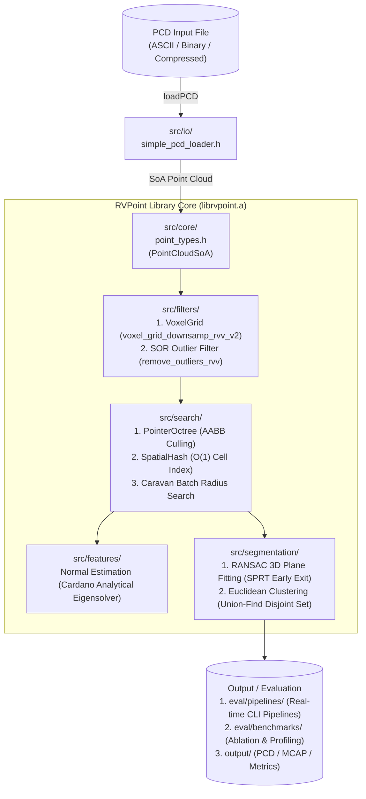

# RVPoint Architecture Specification

> **Version**: 1.0.0  
> **Status**: Official Architecture Reference  
> **Namespace**: `rvpoint` (alias: `rvv_pcl`)  
> **Target Hardware**: RISC-V 64-bit with RVV 1.0 Vector Extension (`rv64gcv`)

---

## 1. Executive Overview

**RVPoint** is a high-performance, zero-dependency C++17 point cloud perception library purpose-built for **RISC-V architectures with Vector Extensions (RVV 1.0)**. It provides drop-in, hardware-accelerated replacements for core Point Cloud Library (PCL) algorithms across robotics, autonomous driving (LiDAR), and 3D computer vision.

### Key Architectural Pillars
1. **Contiguous Structure-of-Arrays (SoA)**: Data layouts engineered for max-width vector loads (`vle32.v`, LMUL=8) without strided gather overhead.
2. **Analytical & Closed-Form Solvers**: Replaces iterative numerical routines with direct analytical equations (e.g. Cardano's closed-form cubic eigenvalue solver for 3D covariance matrices).
3. **Cache-Conscious Spatial Indexing**: Flat spatial hash tables and pointer octrees with tight bounding-box culling.
4. **Pure 3D Geometric Backbones**: Full 3D coordinate evaluation across all processing stages.

---

## 2. System Architecture Diagram



---

## 3. Data Representation & Memory Layout

### 3.1 AoS vs. SoA Memory Layout
Standard PCL uses Array-of-Structures (`std::vector<PointXYZ>`), which creates interleaved memory (`X Y Z _ X Y Z _`). On SIMD and vector architectures, loading interleaved coordinates requires either expensive strided loads or permutation instructions.

RVPoint uses **`PointCloudSoA`** as its primary internal representation:

```cpp
namespace rvpoint {
struct PointCloudSoA {
    std::vector<float> x;          // Contiguous X coordinates
    std::vector<float> y;          // Contiguous Y coordinates
    std::vector<float> z;          // Contiguous Z coordinates
    std::vector<float> intensity;  // LiDAR reflection intensity
    std::vector<uint8_t> r, g, b;  // Color channels
    std::size_t n = 0;             // Point count
};
}
```

#### Vector Memory Alignment
- Each array (`x`, `y`, `z`) is stored as a flat, contiguous buffer.
- RVV load instructions (`__riscv_vle32_v_f32m8`) stream 8 vector registers of data per instruction (up to 32 floats per cycle on standard 128-bit VLEN hardware, or 128 floats on 512-bit VLEN hardware).

---

## 4. Module Architecture & Algorithm Design

### 4.1 `src/core/` — Foundations & Vector Helpers
* **[`point_types.h`](../src/core/point_types.h)**: Defines AoS (`PointXYZ`, `PointXYZI`, `Normal`, `PointNormal`) and SoA (`PointCloudSoA`) types. Provides backward-compatible namespace aliasing:
  ```cpp
  namespace rvv_pcl = rvpoint;
  ```
* **[`rvv_common.h`](../src/core/rvv_common.h)** / **[`rvv_common.cpp`](../src/core/rvv_common.cpp)**: Hardware vector abstraction layer for RVV 1.0 intrinsics:
  - `get_dist_sq_rvv()`: Vectorized squared Euclidean distance accumulation ($dx^2 + dy^2 + dz^2$).
  - `calc_mean_std_rvv()`: Single-pass vector reduction for mean ($\mu$) and standard deviation ($\sigma$).
* **[`profiler.h`](../src/core/profiler.h)**: Sub-millisecond cycle and time profiling wrapper.

---

### 4.2 `src/filters/` — Voxel Grid & SOR Outliers
* **[`voxel_grid.h`](../src/filters/voxel_grid.h)** / **[`voxel_grid_downsamp.cpp`](../src/filters/voxel_grid_downsamp.cpp)**:
  - `voxel_grid_downsamp_rvv_v2`: High-throughput sort-based spatial decimation. Discards standard `std::map` tree overhead in favor of a 1D linearized Morton/spatial hash, followed by contiguous centroid reduction using `__riscv_vfadd_vv_f32m8`.
* **[`statistical_outlier_removal.h`](../src/filters/statistical_outlier_removal.h)** / **[`statistical_outlier_removal.cpp`](../src/filters/statistical_outlier_removal.cpp)**:
  - Vectorized Statistical Outlier Removal (SOR). For each point, queries $k$-nearest neighbors, computes distance metrics, and classifies inliers via vector comparison:
    $$\text{is\_inlier} = (d_i \le \mu + \alpha \cdot \sigma)$$

---

### 4.3 `src/features/` — Analytical Normal Estimation
* **[`normal_estimation.h`](../src/features/normal_estimation.h)** / **[`normal_estimation.cpp`](../src/features/normal_estimation.cpp)**:
  - **Covariance Accumulation**: Vectorized calculation of the $3 \times 3$ symmetric covariance matrix $\mathbf{C} = \frac{1}{K} \sum (p_i - \bar{p})(p_i - \bar{p})^T$.
  - **Cardano Closed-Form Solver**: Solves the characteristic cubic polynomial $\det(\mathbf{C} - \lambda \mathbf{I}) = 0$ directly using trigonometric roots:
    $$\lambda_3 = 2 \sqrt{-p/3} \cos\left(\frac{\theta + 4\pi}{3}\right) - \frac{a}{3}$$
    This completely eliminates iterative Jacobi rotations, reducing normal estimation time by **$>4\times$**.
  - **Viewpoint Flipping**: Vectorized dot product ensuring surface normals point towards the sensor origin: $\mathbf{n} \cdot (\mathbf{v}_p - \mathbf{p}) > 0$.

---

### 4.4 `src/search/` — Spatial Indexing & Nearest Neighbors
* **[`pointer_octree.h`](../src/search/pointer_octree.h)** / **[`pointer_octree.cpp`](../src/search/pointer_octree.cpp)**:
  - Compact tree structure where internal nodes store exact Axis-Aligned Bounding Boxes (AABB).
  - Sphere-box overlap pruning: branches outside query radius $r$ are pruned immediately before leaf access.
* **[`spatial_hashing.h`](../src/search/spatial_hashing.h)** / **[`spatial_hashing.cpp`](../src/search/spatial_hashing.cpp)**:
  - $O(1)$ metric spatial grid for dense local neighbor searches.
* **[`caravan_radius_search.h`](../src/search/caravan_radius_search.h)** / **[`caravan_pointer_octree.h`](../src/search/caravan_pointer_octree.h)**:
  - Caravan batch query executor that traverses octree nodes simultaneously for groups of query points, amortizing tree traversal cost over multiple vector registers.

---

### 4.5 `src/segmentation/` — Plane RANSAC & Euclidean Clustering
* **[`ransac_plane.h`](../src/segmentation/ransac_plane.h)** / **[`ransac_plane.cpp`](../src/segmentation/ransac_plane.cpp)**:
  - 3D Ground plane segmentation using **SPRT (Sequential Probability Ratio Test)** early rejection: hypotheses with poor initial samples are rejected after testing $<5\%$ of points.
  - Plane distance vector kernel:
    $$d_i = |a \cdot x_i + b \cdot y_i + c \cdot z_i + d|$$
    Evaluated using fused multiply-add (`__riscv_vfmacc_vf_f32m8`).
* **[`euclidean_clustering.h`](../src/segmentation/euclidean_clustering.h)** / **[`euclidean_clustering.cpp`](../src/segmentation/euclidean_clustering.cpp)**:
  - Disjoint-Set / Union-Find clustering with path compression and union-by-rank.
  - Spatial radius clustering executes in linear time $O(N)$ with min/max cluster size filtering.

---

### 4.6 `src/io/` — Zero-Dependency PCD Parser
* **[`simple_pcd_loader.h`](../src/io/simple_pcd_loader.h)**:
  - Zero-dependency parser for Point Cloud Data (`.pcd`) format.
  - Supports `ascii`, `binary`, and `binary_compressed` (LZF compression) formats without external libraries.

---

## 5. End-to-End Perception Pipelines

The evaluation suite ([`eval/pipelines/`](../eval/pipelines)) provides full real-time perception drivers:

| Pipeline Executable | Key Characteristics | Target Application |
| :--- | :--- | :--- |
| **`pipeline_3d_ultimate`** | Flat 3D Spatial Grid + Fast SOR + SPRT RANSAC + Union-Find | **Recommended for production & real-time robotics** |
| **`pipeline_3d_ultra`** | 10-Stage Pipeline with Cardano Normals & Profiler | **Complete scientific & benchmarking evaluation** |
| **`pipeline_3d_turbo`** | Fused SOR + Normal single-pass traversal | **Ultra-low latency streaming LiDAR** |
| **`pipeline_export`** | Full diagnostic PCD serialization pipeline | **Offline visualization & Foxglove export** |
| **`scalar_25d_baseline`** | Pure C++ scalar baseline implementation | **Speedup reference verification** |

---

## 6. RVV 1.0 Intrinsics Optimization Rules

When adding new vector kernels to `rvpoint`, follow these 5 core rules:

1. **Maximize LMUL (Register Grouping)**:
   - Prefer `m8` (e.g. `vfloat32m8_t`) for arithmetic-dense loops to maximize throughput and instruction retirement efficiency.
2. **Use Vector-Scalar Fused Multiply-Add (FMA)**:
   - Use `__riscv_vfmacc_vf_f32m8` for linear combinations ($y = a \cdot x + y$) to achieve single-cycle MAC performance.
3. **Employ Stripmining Loops**:
   - Always manage vector length with `__riscv_vsetvl_e32m8(remaining)` to ensure portability across different hardware `VLEN` sizes (128, 256, 512, 1024).
4. **Avoid Gather/Scatter When Possible**:
   - Design data structures so vector loads are sequential (`__riscv_vle32_v_f32m8`).
5. **Fast Analytical Equations Over Loops**:
   - Prefer polynomial or algebraic approximations with hardware vector square-root (`__riscv_vfsqrt_v_f32m8`) and vector reciprocal over iterative algorithms.
