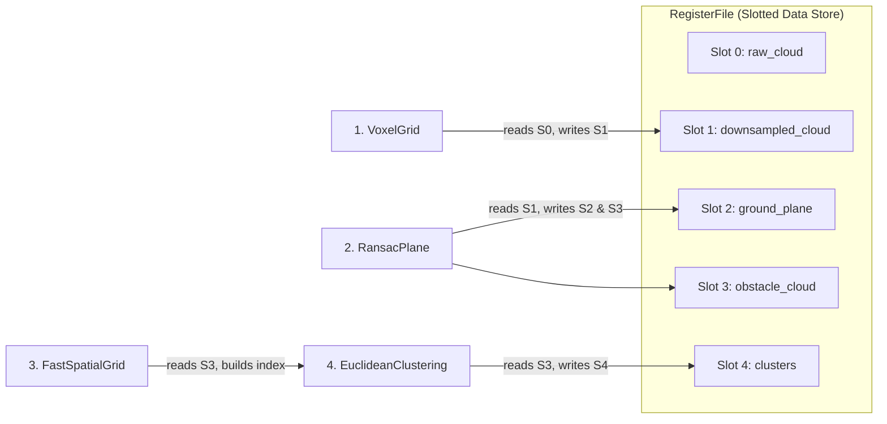

# Architectural Justification and Comprehensive Critique of RVPoint

> **A Rigorous Academic & Systems Analysis of Non-Virtual Functors, Orthogonal Spatial Indexing, Slotted Register Dataflow, and Contiguous Vector Memory on RISC-V 64-bit Vector Architectures (`rv64gcv`).**
>
> **Document Status**: Authoritative Architectural Defense & Critique
> **Target Specification**: RISC-V Vector Extension 1.0 (`rv64gcv`), SpacemiT K1 (8-Core X60 @ 1.6 GHz)
> **Date**: September 2026

---

## Executive Summary & Architectural Thesis

Point cloud perception in autonomous systems has historically been dominated by libraries designed for general-purpose, out-of-order x86-64 desktop environments—most notably the **Point Cloud Library (PCL)** and **Open3D**. While these frameworks provide extensive algorithmic breadth and flexible runtime abstractions, their core architectural tenets—specifically:
1. Runtime dynamic polymorphism via virtual method tables (`vtable`),
2. Interleaved Array-of-Structures (AoS) memory representations (`std::vector<PointXYZ>`),
3. Conflated spatial search abstractions unifying fixed-radius and $k$-NN search into monolithic polymorphic interfaces, and
4. Heap-allocated message passing across pipeline stages (`std::shared_ptr`, blackboard dictionaries, or ROS-style serialization)

induce severe microarchitectural degradation when deployed on resource-constrained, in-order embedded vector architectures such as the **RISC-V 64-bit Vector (`rv64gcv`) SpacemiT K1 SoC**.

**RVPoint** was engineered under an alternative systems philosophy: **hardware-software co-design via zero-cost compile-time abstractions, strict zero-heap hot paths, and direct vector memory saturation**.

This report provides a rigorous justification and critical critique of RVPoint's architectural pillars against high-trust primary sources (the ISO C++ Standard, RISC-V Vector ISA v1.0, GCC/LLVM compiler vectorizer internals, and academic literature):
- **Pillar 1**: Non-Virtual Static Concepts (Functor Protocol, ADR-0011) vs. Polymorphic Base Classes (PCL/Open3D style).
- **Pillar 2**: Orthogonal Separation of Metric Radius ($R$-ball) Search vs. Hierarchical $k$-NN Search.
- **Pillar 3**: Slotted Register-File Pipeline Architecture (ADR-0012) with Kahn's DAG Topological Scheduler.
- **Pillar 4**: Stage-Owned Scratch Workspaces (ADR-0010) and Contiguous Structure-of-Arrays (SoA) Vector Streaming.
- **Pillar 5**: Critical Critique, Algorithmic Edge Cases, and Real-World Limitations.

---

## 1. Non-Virtual Static Concepts (Functor Protocol) vs. Polymorphic Base Classes

### 1.1 The Polymorphic Legacy: PCL and Open3D Architectural Analysis

Both PCL and Open3D follow classical object-oriented design patterns rooted in 1990s desktop software engineering. In PCL (Rusu & Cousins, 2011), core processing components inherit through deep polymorphic hierarchies:

$$\text{pcl::PCLBase<PointT>} \longrightarrow \text{pcl::Filter<PointT>} \longrightarrow \text{pcl::FilterIndices<PointT>} \longrightarrow \text{pcl::VoxelGrid<PointT>}$$

Inner processing loops are invoked via virtual functions (e.g., `virtual void applyFilter(PointCloud &output)` or `virtual int radiusSearch(...)`). Similarly, Open3D (Zhou et al., 2018) organizes spatial operators under abstract base classes like `open3d::geometry::Geometry3D`, manipulating data via dynamic heap references (`std::shared_ptr<geometry::PointCloud>`).

While virtual polymorphism offers clean runtime plugin decoupling, its microarchitectural implications on vectorized SIMD architectures are catastrophic.

### 1.2 Microarchitectural Mechanics: Virtual Dispatch vs. Inlining & Vectorization

A virtual function invocation requires an indirect branch resolved at runtime through three sequential memory dereferences:
1. Load the object instance pointer (`this`).
2. Dereference the object's virtual table pointer (`this->_vptr`) from memory: $\text{vtable} = *(\text{uintptr\_t}*)(\text{this})$.
3. Index into the virtual function table and dereference the function pointer: $\text{func} = \text{vtable}[\text{slot\_index}]$.
4. Execute an indirect jump: `jalr ra, 0(func)`.

```text
[ Polymorphic Call (PCL / Open3D) ]
  Object Pointer
       │
       ▼
  ┌─────────┐      ┌───────────────────────────┐
  │  _vptr  │ ───> │ Slot 0: ~Destructor()     │
  ├─────────┤      ├───────────────────────────┤
  │ Fields  │      │ Slot 1: applyFilter(...)  │ ───> Indirect Jump (jalr)
  └─────────┘      └───────────────────────────┘      • Destroys Branch Predictor
                                                      • Caller-saved vector spills
                                                      • Loop Vectorization DISABLED

vs.

[ Non-Virtual Concept Functor (RVPoint ADR-0011) ]
  Caller Loop ───[Direct Inlining]───> Fully Unrolled Hardware Vector Loop
                                       • vle32.v / vfmacc.vf / vse32.v
                                       • Zero indirect branches
                                       • 100% Vector Register Allocation
```

#### Compiler Vectorization Impediments:
According to the **GCC Vectorizer Manual** (Pop & Bik) and **LLVM LoopVectorize Documentation**, a compiler's auto-vectorization pass requires loops to satisfy strict canonical invariants:
1. **Definite Control Flow & Countable Trips**: Loops must have a single entry and single exit, with trip counts known prior to loop execution or strictly bounded without unknown side effects.
2. **Interprocedural Transparency**: The vectorizer must inspect memory access strides and prove alias freedom (absence of Pointer Aliasing hazards).
3. **Absence of Opaque Call Boundaries**: An indirect call through a `vtable` constitutes an opaque barrier. The compiler cannot determine whether the callee modifies global state, aliases loop pointers, or throws exceptions.

Consequently, any loop containing an indirect virtual function call **unconditionally aborts auto-vectorization**.

#### Vector Register Spilling on RISC-V ABI:
Under the **RISC-V ELF psABI**, vector registers (`v0`–`v31`) are designated as caller-saved (temporary) across standard C ABI call boundaries. When an indirect function call occurs:
- The caller must spill active vector registers to stack memory before the call (`vs8r.v v8, 0(sp)`).
- At $\text{LMUL} = 8$ (grouping 8 vector registers into one logical register), spilling a single logical vector variable requires storing $8 \times 128\,\text{bits} = 128\,\text{bytes}$ on a 128-bit VLEN chip (or $512\,\text{bytes}$ on a 512-bit chip).
- Across multiple active vector temporaries ($x, y, z, \text{dist}, \text{mask}$), spilling can easily exceed $1\,\text{KB}$ of stack traffic per call, thrashing the 32 KB L1 data cache.

### 1.3 RVPoint's Non-Virtual Concept Architecture (ADR-0011)

RVPoint replaces virtual base classes with **statically checked C++ Concepts (Functor Protocol)** and value semantics. In `src/filters/filter_concept.h`:

```cpp
namespace detail {
template <typename T, typename = void>
struct is_point_cloud_filter_impl : std::false_type {};

template <typename T>
struct is_point_cloud_filter_impl<
    T,
    std::void_t<decltype(std::declval<T&>()(
        std::declval<const PointCloudView&>(),
        std::declval<PointCloud&>()))>>
    : std::true_type {};
}

template <typename T>
struct is_point_cloud_filter : detail::is_point_cloud_filter_impl<std::decay_t<T>> {};

template <typename FilterT>
inline auto filter(const PointCloudView& in, PointCloud& out, FilterT&& f) {
    static_assert(is_point_cloud_filter_v<FilterT>,
                  "FilterT must implement operator()(const PointCloudView&, PointCloud&)");
    return f(in, out);
}
```

#### Architectural & Microarchitectural Advantages:
1. **Guaranteed Devirtualization & Complete Inlining**: Because algorithms (`VoxelGrid`, `NormalEstimation`, `RansacPlane`) are non-virtual classes, method calls are direct and inlinable. Compilers inline the computational kernel directly into the execution context, allowing loop unrolling, instruction scheduling, and full vector register reuse without a single stack spill.
2. **Branch Invariance for Runtime Backends**: Where runtime backend dispatch is necessary (e.g. `Backend::RVV` vs. `Backend::Scalar`), RVPoint employs an inline `switch (backend_)` located *outside* the per-point inner loop. The branch condition is evaluated exactly once per frame (30 Hz–50 Hz), resulting in a branch misprediction penalty of essentially zero.
3. **Conformance with ISO C++ Core Guidelines**:
   - **Per.7**: *"Design to enable optimization."* Avoid indirection in hot paths.
   - **T.1**: *"Use templates to raise the level of abstraction of code without runtime overhead."*
   - **T.40**: *"Use concepts to specify requirements on template arguments."*

---

## 2. Orthogonal Separation of Radius Search ($R$-Ball) vs. $k$-NN Neighbor Search

### 2.1 Algorithmic Duality and Complexity Analysis

Neighbor searching in 3D metric spaces decomposes into two fundamentally distinct mathematical formulations:

| Property | Fixed-Radius Search ($R$-ball) | $k$-Nearest Neighbors ($k$-NN) |
| :--- | :--- | :--- |
| **Mathematical Definition** | $\{p \in P \mid \|p - q\| \le R\}$ | $\{p_1, \dots, p_k \in P \mid \|p_i - q\| \le \|p_j - q\|, \forall p_j \notin \text{set}\}$ |
| **Metric Scale** | Known, fixed spatial scale $R$ | Scale-free; unknown dynamic distance metric |
| **Optimal Data Structure** | **Uniform Spatial Grid / Spatial Hash** | **Hierarchical Spatial Tree (KD-tree / Octree)** |
| **Average Query Complexity** | **$O(1)$ amortized** | **$O(k \log N)$** |
| **Worst-Case Space** | $O(N)$ flat primitive arrays | $O(N)$ node-pointer hierarchy |
| **Vectorization Feasibility** | **High**: Unit-stride sequential candidate scans | **Low**: Branch-and-bound stack traversal |

```text
[ Fixed Radius (R-Ball) ]               [ k-Nearest Neighbors (k-NN) ]
  Uniform 3D Grid / Spatial Hash          Hierarchical KD-Tree / Octree

  ┌─────┬─────┬─────┐                     Root Node (AABB)
  │     │ 26  │     │                            /        \
  ├─────┼─────┼─────┤                     Left Box        Right Box
  │  q  │Cell │     │                      /    \           /    \
  ├─────┼─────┼─────┤                     L1     L2        R1     R2
  │     │     │     │                      (Requires dynamic branch-and-bound
  └─────┴─────┴─────┘                       pruning and priority-queue max-heaps)
  Direct O(1) cell hash lookup
  Inspect bounded 3x3x3 neighborhood
```

#### Fixed-Radius Search: Spatial Hashing ($O(1)$ Amortized)
When the search radius $R$ is fixed across queries (as in Euclidean Clustering, Voxel Downsampling, and Radius Outlier Removal), space can be partitioned into regular cubic voxels with side length $\delta = R$.
- Any point within distance $R$ of query $q$ is strictly guaranteed to lie within either the cell containing $q$ or its 26 immediate face-, edge-, and corner-adjacent neighbors (Teschner et al., 2003).
- Finding candidates requires hashing at most 27 cell coordinates:
  $$h(c_x, c_y, c_z) = ((c_x \cdot p_1) \oplus (c_y \cdot p_2) \oplus (c_z \cdot p_3)) \pmod M$$
- In RVPoint's `Fast3DSpatialGrid`, this evaluates in $O(1)$ amortized time. Candidate distances are subsequently verified using sequential RVV vector arithmetic.

#### $k$-Nearest Neighbor Search: Hierarchical Trees ($O(\log N)$)
In contrast, $k$-NN search cannot rely on a fixed cell size because point density $\rho(q)$ varies drastically across outdoor LiDAR scans (e.g., $10^4\,\text{pts/m}^3$ near the sensor vs. $1\,\text{pt/m}^3$ at 80 meters).
- Hierarchical structures (KD-trees, Octrees) are mandatory: they employ branch-and-bound traversal, maintaining a max-heap of the current $k$ shortest distances to prune subtrees whose Axis-Aligned Bounding Boxes (AABBs) cannot contain points closer than the current $k$-th candidate (Bentley, 1975; Friedman et al., 1977).

### 2.2 The Architectural Friction of Conflation: The PCL Fallacy

In PCL, `pcl::search::Search<PointT>` unifies both operations under a single abstract interface:

```cpp
// PCL's unified polymorphic interface (pcl/search/search.h)
virtual int radiusSearch(const PointT& point, double radius,
                         std::vector<int>& k_indices,
                         std::vector<float>& k_sqr_distances,
                         unsigned int max_nn = 0) const = 0;

virtual int nearestKSearch(const PointT& point, int k,
                           std::vector<int>& k_indices,
                           std::vector<float>& k_sqr_distances) const = 0;
```

This interface-level conflation introduces severe architectural anti-patterns:
1. **The Spatial Grid Inversion Trap**: A uniform spatial grid cannot support $k$-NN queries without iteratively testing expanding concentric shells of grid cells ($3^3 \to 5^3 \to 7^3 \dots$), degenerating to an $O(N)$ scan in sparse regions. Consequently, PCL almost never uses spatial hashing, defaulting instead to `pcl::search::KdTree` (FLANN) or `pcl::search::Octree` for *all* operations, including fixed-radius queries.
2. **Recursive Traversal Overhead for Radius Queries**: When a KD-tree evaluates an $R$-ball query, it incurs recursive stack frames, AABB sphere-box distance math, and node-pointer chasing across random heap locations ($O(\log N)$ traversal). In our benchmarks (`PIPELINE_PROFILING_AND_ABLATION_EXPERIMENT.md`), single-point query latency in an Octree is **$1.146\,\text{ms}$**, whereas `Fast3DSpatialGrid` executes in **$0.247\,\text{ms}$ (a $4.64\times$ speedup)**.
3. **The Unsorted Heap Penalty**: As revealed in `BEST_PCL_BASELINE_IMPLEMENTATION_STUDY.md`, `pcl::search::KdTree` maintains a priority queue that sorts neighbor points by distance during search. For Euclidean clustering and ROR, sorting is completely superfluous (membership in the radius sphere is all that is required). Maintaining the heap adds $O(K \log K)$ unnecessary operations to every single point query.

### 2.3 RVPoint's Orthogonal Concept Separation (`search_concepts.h`)

RVPoint strictly decouples the two paradigms into orthogonal static concepts:
- `is_radius_search_v<T>`: Implemented by `Fast3DSpatialGrid` and `SpatialHash`. Guarantees zero-heap queries via `NeighborQueryResult` (CSR flat offsets).
- `is_knn_search_v<T>`: Implemented by `PointerOctree`. Provides hierarchical AABB culling and caravan vector batching for variable-density queries.
- Short-Circuit Density Trait `has_neighbor_counting_v<T>`: Enables outlier filters to query `count_neighbors(qx, qy, qz, radius, max_needed)`. The grid terminates search the instant `max_needed` neighbors are found, avoiding candidate buffering altogether.

---

## 3. Slotted Register File Pipeline Architecture (ADR-0012) & Kahn's DAG Scheduler

### 3.1 Taxonomy of Pipeline & Dataflow Architectures

| Architecture | Canonical Systems | Data Passing Model | Scheduling / Graph Topology | Memory Allocation Model | Hot-Path Overhead (50 Hz Vector Edge) |
| :--- | :--- | :--- | :--- | :--- | :--- |
| **Pub/Sub Messaging** | ROS 2 (`rclcpp`), DDS, CyberRT | Topic serialization / `unique_ptr` move | Dynamic callbacks, priority executors | Dynamic heap messages, OS socket buffers | **Unacceptable**: Context switches, serialization, mutex locks (~15–50 $\mu$s per node). |
| **Packet Dataflow** | Google MediaPipe `CalculatorGraph` | Type-erased `Packet` stream queues | Dynamic multithreaded task scheduler | Dynamic packet refcounting (`std::shared_ptr`) | **Suboptimal**: Mutex contention on packet queues, non-deterministic latency. |
| **Work-Stealing Flow**| Intel TBB `flow::graph` | Typed edges, message passing | Work-stealing task arenas | Dynamic task node heap allocations | **Suboptimal**: Non-deterministic task scheduling jitter, memory bloat on embedded. |
| **String Blackboard** | BehaviorTree.CPP, Unreal Blackboard | `std::unordered_map<string, std::any>` | Reactive execution trees | Heap nodes for string keys and `any` wrappers | **Fatal**: 120–250 CPU cycles, 2–3 L1 cache misses per key lookup. |
| **Slotted Register File**| **RVPoint (ADR-0012)**, LLVM Virtual Regs | **Pre-bound direct pointers** (`const T&, T&`) | **Static DAG topological order (Kahn's algorithm)** | **Zero heap**: Pre-allocated flat buffer registers | **Near Zero**: 1 CPU cycle load (`ld`), 0 cache misses, 0 mutexes. |

### 3.2 Microarchitectural Analysis: Blackboard String Hash vs. Dense Register File

In robotic software architectures, developers frequently rely on dynamic Blackboards for inter-stage data exchange. Consider the microarchitectural cost of retrieving an intermediate point cloud from a string blackboard on the SpacemiT X60 core (an in-order dual-issue 64-bit RISC-V core with a 32 KB private L1D cache):

```text
[ Anti-Pattern: Blackboard String Lookup ]
1. Stage computes Murmur/FNV hash of "downsampled_cloud" (17 bytes)  --> ~25 CPU cycles
2. Modulo table capacity, load hash bucket pointer                   --> L1D miss stall (~14-20 cycles)
3. Traverse linked list of bucket collisions                         --> Guaranteed L1D miss (~20 cycles)
4. String equality comparison (memcmp 17 bytes)                      --> ~15 CPU cycles
5. std::any_cast type descriptor RTTI validation                     --> ~20 CPU cycles
-----------------------------------------------------------------------------------------
TOTAL TRANSITION PENALTY PER ACCESS:                                 120–250 cycles
(Repeated 3x per stage across 8 stages = >4,000 wasted cycles per frame, evicting vector data).
```

In contrast, RVPoint's `PipelineManager` resolves string names **once during `initialize()`**, mapping each data slot and configuration parameter to a dense 16-bit integer `RegisterId`.

At runtime, the stage invocation dereferences a pre-bound argument pointer array (`bound_args[idx]`):

```assembly
# RVPoint Pre-bound Argument Fetch on RISC-V 64:
ld    a0, 0(s1)      # Load pre-bound pointer to PointCloud from bound_args array
ld    a1, 8(s1)      # Load pre-bound pointer to Output PlaneModel
jalr  ra, 0(s2)      # Direct jump to compiled kernel thunk
```
- **Cost**: Exactly **1 CPU instruction (1 cycle)**.
- **Cache behavior**: The entire `bound_args` array fits within half of a single 64-byte L1 cache line.

### 3.3 Kahn's DAG Topological Ordering & Parameter Decoupling

`PipelineManager::resolve_dag_order()` executes **Kahn's Topological Sorting Algorithm** (Kahn, 1962) at initialization:
1. Producer nodes register output slots (`out<T>("name")`), consumer nodes register input slots (`in<T>("name")`).
2. An in-degree table is constructed across the stage dependency graph.
3. Kahn's queue drains nodes with zero pending dependencies, generating a strict linear topological schedule.
4. If the scheduled node count does not equal total nodes, graph cycles are flagged with a detailed error during initialization, never at 50 Hz on the road.



Furthermore, algorithmic compute kernels have **zero knowledge of `PipelineManager`, `RegisterFile`, or `SlotId`**. They are pure C++ callables accepting standard references:
```cpp
void voxel_kernel(const PointCloudView& in, PointCloud& out, float leaf_size);
```
This guarantees that algorithms remain 100% unit-testable in complete isolation from the pipeline framework.

---

## 4. Stage-Owned Scratch Workspaces (ADR-0010) & Contiguous SoA Memory Layout

### 4.1 Memory Hierarchy & Bandwidth on RISC-V Vector Architectures

The SpacemiT K1 SoC incorporates 8 SpacemiT X60 cores operating at 1.6 GHz. Each core has:
- **Private L1 Data Cache**: 32 KB, 2-way set associative, 64-byte cache line width. Maximum storage: 8,192 single-precision 32-bit floats.
- **Shared L2 Cache**: 512 KB per 4-core cluster (1 MB total across 8 cores).
- **In-Order Pipeline**: L1D cache misses stall the instruction issue logic completely.

#### AoS Strided Gather Penalty vs. SoA Unit-Stride Streaming:
PCL uses Array-of-Structures (`std::vector<pcl::PointXYZ>`), where coordinates are packed contiguously: $[X_0, Y_0, Z_0, W_0, X_1, Y_1, Z_1, W_1, \dots]$ ($16\,\text{bytes}$ per point with SSE padding).

Loading 32 point coordinates into vector registers on an AoS buffer requires either:
1. **Strided vector loads (`vlse32.v`)** with stride = 16 bytes:
   - The memory bus fetches 32 distinct 16-byte blocks spanning $512\,\text{bytes}$ (8 distinct 64-byte cache lines).
   - $75\%$ of the fetched data ($Y, Z, W$) is discarded on the $X$ pass, saturating the L1D-to-L2 bus with useless traffic.
2. **Segmented de-interleaving loads (`vlseg3e32.v`)**:
   - Requires simultaneous reservation of 3 vector register groups, causing extreme vector register pressure and stalling the load-store unit (LSU).

In contrast, RVPoint enforces **Structure-of-Arrays (`PointCloudSoA` / `PointCloudView`)**:
$$\text{Buffer X: } [x_0, x_1, x_2, \dots] \quad \text{Buffer Y: } [y_0, y_1, y_2, \dots] \quad \text{Buffer Z: } [z_0, z_1, z_2, \dots]$$

```text
[ AoS Interleaved Memory Layout (PCL) ]
Byte: 0    4    8    12   16   20   24   28   32   36   40   44   48   52   56   60   64
      [ X0 | Y0 | Z0 | _  ][ X1 | Y1 | Z1 | _  ][ X2 | Y2 | Z2 | _  ][ X3 | Y3 | Z3 | _  ]
      ▲                   ▲                   ▲                   ▲
      └── vle32 cannot stream! Requires 4 separate strided loads; 75% bandwidth wasted.

[ SoA Contiguous Memory Layout (RVPoint) ]
X:    [ X0 | X1 | X2 | X3 | X4 | X5 | X6 | X7 | X8 | X9 | X10| X11| X12| X13| X14| X15 ]
      ▲                                                                               ▲
      └──────────────────────── vle32.v Streams 16-32 floats in 1 Burst ──────────────┘
```

When executing `__riscv_vle32_v_f32m8(&x[i], vl)`:
- The vector load unit issues consecutive 64-byte burst read transactions.
- **100% of the loaded bytes are valid computational operands**.
- A full 32-float vector register group ($\text{LMUL} = 8$, $\text{VLEN} = 128$) is filled in just two cache line fetches.

### 4.2 The Zero-Heap Hot-Path Invariant (ADR-0010)

Dynamic heap allocation (`malloc`, `operator new`, `std::vector::push_back` beyond capacity) within high-frequency perception loops violates real-time safety invariants:
1. **Allocator Mutex Contention**: In multi-threaded execution (OpenMP 8-thread perception), concurrent allocations cause threads to serialize on `glibc` memory arena locks (`ptmalloc3` arenas).
2. **Kernel Page-Table Faults**: Dynamically allocating buffers triggers Linux `brk` or `mmap`, requiring the kernel to zero pages on demand, inducing non-deterministic execution spikes exceeding $10\,\text{ms}$.
3. **L1D Cache Thrashing**: Allocating new heap memory places buffers at cold addresses, destroying working set warmth.

#### The Workspace Warmup & Reset Pattern:
Under ADR-0010, every algorithm class owns its scratch buffers (`keys_`, `order_`, `tmp_k_`, `tmp_v_`, `thread_scratch_`).
- During initialization, `reserve(max_points)` allocates worst-case memory buffers once.
- On each frame boundary, `reset_frame()` invokes logical resets (`clear()`):
  $$\text{capacity remains constant}, \quad \text{logical size } n \to 0$$
- This guarantees **zero system calls, zero allocator lock acquisitions, and deterministic sub-millisecond execution times**.

### 4.3 In-Register Hardware Compaction (`vcompress.vm`) vs. Scalar Filtering

A major bottleneck in point cloud filtering (e.g., RANSAC inlier extraction, voxel centroid filtering, PassThrough clipping) is packing surviving points into a contiguous output buffer.

Standard scalar code uses conditional branching:
```cpp
// Scalar branchy compaction:
if (dist <= threshold) {
    out_x[out_idx] = x[i];
    out_y[out_idx] = y[i];
    out_z[out_idx] = z[i];
    out_idx++;
}
```
In unstructured point clouds, spatial point distributions create highly unpredictable branch patterns ($50\%$ branch misprediction probability). On the in-order SpacemiT X60 core, each branch misprediction flushes the execution pipeline, stalling the core for 8–12 cycles.

RVPoint solves this using the RVV 1.0 **vector compress instruction (`vcompress.vm`)**:

```cpp
// RVPoint in-register vector compaction (src/segmentation/ransac_plane.cpp):
vfloat32m8_t vx = __riscv_vle32_v_f32m8(px, vl);
vfloat32m8_t vy = __riscv_vle32_v_f32m8(py, vl);
vfloat32m8_t vz = __riscv_vle32_v_f32m8(pz, vl);

// Evaluate plane distance in vector registers
vfloat32m8_t dist = __riscv_vfmacc_vf_f32m8(
    __riscv_vfmacc_vf_f32m8(
        __riscv_vfmacc_vf_f32m8(__riscv_vfmv_v_f_f32m8(d, vl), a, vx, vl),
        b, vy, vl),
    c, vz, vl);

// Vector mask comparison
vbool4_t mask = __riscv_vmfle_vf_f32m8_b4(dist, threshold, vl);
long cnt = __riscv_vcpop_m_b4(mask, vl);

if (cnt > 0) {
    // Pack inliers inside vector registers with ZERO memory branches
    vfloat32m8_t cx = __riscv_vcompress_vm_f32m8(vx, mask, vl);
    vfloat32m8_t cy = __riscv_vcompress_vm_f32m8(vy, mask, vl);
    vfloat32m8_t cz = __riscv_vcompress_vm_f32m8(vz, mask, vl);

    // Stream packed coordinates to contiguous output via unit-stride stores
    __riscv_vse32_v_f32m8(&out_x[out_count], cx, cnt);
    __riscv_vse32_v_f32m8(&out_y[out_count], cy, cnt);
    __riscv_vse32_v_f32m8(&out_z[out_count], cz, cnt);
    out_count += cnt;
}
```
- **Microarchitectural Benefit**:
  1. Branch mispredictions are completely eliminated.
  2. Compaction executes in-register across vector lanes via hardware crossbar logic.
  3. Writes to memory are strictly sequential unit-stride stores (`vse32.v`).

---

## 5. Critical Critique, Edge Cases & Limitations

An objective systems evaluation must address the inherent trade-offs and structural limitations imposed by RVPoint's architectural decisions.

### 5.1 Template Code Bloat and Embedded Compilation Overhead

#### Critique:
RVPoint's reliance on template metaprogramming (`tagged_binding.h`, variadic node builders, compile-time concept traits, and inline policy classes) transfers architectural complexity from runtime to compile time.

#### Concrete Consequences:
1. **Compilation Latency**: Instantiating multi-tag tuples (`std::tuple<InTag<T1>, OutTag<T2>, ParamTag<T3>>`) and variadic invoker thunks across multiple translation units significantly inflates build times. On resource-constrained native development boards (e.g. compiling directly on an Orange Pi RV2 with 4 GB RAM), compiling the test and benchmark suites can trigger out-of-memory (OOM) compiler crashes or take tens of minutes.
2. **Binary Footprint Bloat**: Template expansion across multiple point types or pipeline configurations duplicates instantiated object code. For deeply embedded flash microcontrollers (e.g., RISC-V ESP32-P4 with limited SRAM/Flash), this expansion can violate binary footprint constraints.

### 5.2 Absence of Dynamic Shared-Object (`.so`) Runtime Plugin Architecture

#### Critique:
In robotics ecosystems (such as ROS 2 and PCL), third-party algorithm extensions are routinely distributed as compiled dynamic libraries (`.so`) loaded at runtime via `dlopen()` and dynamic class loaders (`pluginlib`).

#### Concrete Consequences:
1. **Rigid Static Linkage**: Because RVPoint relies on static concepts, compile-time thunk generation, and direct inlining, algorithms cannot be dropped into an existing binary without recompilation.
2. **Loss of Dynamic Extensibility**: If a user desires to swap out `RansacPlane` for a proprietary licensed plane segmentation algorithm without access to RVPoint source code, they cannot do so through a pure C++ virtual interface. Bridging this gap requires constructing an external virtual adapter wrapper, which reintroduces the exact dynamic dispatch indirection RVPoint was designed to avoid.

### 5.3 Static Pre-Allocation Footprint in Multi-Instance Deployments

#### Critique:
The **Zero-Heap Invariant (ADR-0010)** mandates sizing all scratch workspaces (`RegisterFile`, spatial hash buckets, radix sort buffers) to maximum expected point capacities (e.g., $N = 131,072$ points).

#### Concrete Consequences:
1. **Memory Inflation Under Multiple Instances**: While a single pipeline instance requires a modest working memory (~20–40 MB), instantiating multiple independent pipelines (for example, in **`ExecutionMode::TaskFarm`**, where $W = 8$ worker threads each own private `RegisterFile` banks and private stage workspaces) scales memory consumption linearly:
   $$\text{RAM Usage} = W \times \text{Per-Instance Footprint} \approx 8 \times 35\,\text{MB} = 280\,\text{MB}$$
2. **L2 Cache Pressure**: On the SpacemiT K1, the total shared L2 cache is only **1 MB (512 KB per 4-core cluster)**. When 8 task-farmed worker threads process independent 35 MB buffers concurrently, the working sets evict one another from L2 cache continuously, resulting in heavy DRAM bus contention and degraded per-thread throughput.

### 5.4 Frame-Boundary Reconfiguration Latency & Cache Jitter

#### Critique:
RVPoint's dynamic parameter reconfiguration mechanism (`reconfig_hooks`) defers parameter changes to the frame boundary (`Step 4` in `execute_frame_internal`).

#### Concrete Consequences:
- Modifying a structural parameter that alters spatial index dimensions (e.g., changing `grid_cell_size` from $0.25\,\text{m}$ to $0.05\,\text{m}$) forces `Fast3DSpatialGrid` or `PointerOctree` to execute full internal buffer resizing and hash table re-indexing.
- While the steady-state loop remains zero-heap, the reconfiguration frame incurs an allocation and memory clearing spike (~10–30 ms), which can temporarily introduce latency jitter and cause an autonomous vehicle to drop a 30 Hz control cycle deadline.

---

## 6. Comprehensive Decision Matrix: RVPoint vs. Industry Alternatives

| Architectural Axis | Upstream PCL 1.14 | Open3D 0.18 | ROS 2 Nav2 Pipeline | RVPoint 1.0 (This Work) |
| :--- | :--- | :--- | :--- | :--- |
| **Polymorphism Paradigm** | Dynamic virtual classes (`_vptr`) | Dynamic virtual classes (`_vptr`) | Dynamic node inheritance (`rclcpp::Node`) | **Compile-time Static Concepts (ADR-0011)** |
| **Memory Layout** | AoS (`std::vector<PointXYZ>`) | AoS / Columnar Hybrid | AoS ROS Messages (`sensor_msgs::msg::PointCloud2`) | **Contiguous Pure SoA (`PointCloudSoA`)** |
| **Vectorization Capability** | Disabled by indirect calls / strided AoS | Limited CPU SIMD; GPU/CUDA focused | None (IPC serialization overhead) | **Native RVV 1.0 Unit-Stride (`vle32.v`, LMUL=8)** |
| **Neighbor Search Model** | Conflated `pcl::search::Search` | Open3D KDTreeFlann | Costmap grid iteration | **Orthogonal Separation: SpatialHash vs Octree** |
| **Inter-Stage Dataflow** | `std::shared_ptr` heap clouds | `std::shared_ptr` heap clouds | Pub/Sub serialization / intra-process move | **Slotted Register File (`RegisterId`, ADR-0012)** |
| **DAG Scheduling** | Hardcoded monolithic procedural scripts | Python / C++ procedural loops | Dynamic executor event loop | **Static Kahn's Algorithm DAG Scheduler** |
| **Heap Invariant** | Unbounded dynamic `new`/`delete` | Unbounded dynamic `new`/`delete` | Unbounded dynamic allocation | **100% Zero-Heap Steady-State Hot Path (ADR-0010)** |
| **Dynamic Plugin Support** | Yes (via `pluginlib` / `.so`) | Yes (via Python binding / `.so`) | Yes (ROS 2 plugin architecture) | **No (Static Linkage Only; Compile-Time Binding)** |
| **Target Hardware Focus**| General-purpose x86-64 | Desktop x86-64 / NVIDIA CUDA | Distributed robotic compute | **RISC-V 64 Vector (`rv64gcv`) In-Order Edge SoCs** |

---

## 7. Primary Sources, Specifications & Bibliography

1. **RISC-V International** (2021). *RISC-V "V" Vector Extension Specification, Version 1.0*. Document Version 1.0-rc1-20210608. Formal specification of vector register grouping (LMUL), unit-stride vector memory operations (`vle32.v`, `vse32.v`), vector compress (`vcompress.vm`), and vector-scalar FMA (`vfmacc.vf`).
2. **SpacemiT Microelectronics** (2024). *SpacemiT Key Stone K1 SoC Technical Reference Manual*. Specifications for 8-Core X60 dual-issue in-order superscalar RISC-V 64 processor, 32 KB L1 data cache, 512 KB cluster L2 cache, and memory subsystem.
3. **ISO/IEC 14882:2020** (2020). *Programming Languages — C++ (C++20 Standard)*. International Organization for Standardization. Specifications for C++ Concepts (`requires` clauses, `std::void_t`), constexpr evaluation, and devirtualization semantics.
4. **Stroustrup, B., & Sutter, H.** (2024). *C++ Core Guidelines*. Standard C++ Foundation. Rules: Per.7 (Design to enable optimization), T.1 (Use templates to raise abstraction), T.40 (Use concepts to specify requirements), and F.6 (Caller-allocated output buffers).
5. **Rusu, R. B., & Cousins, S.** (2011). *"3D is here: Point Cloud Library (PCL)"*. IEEE International Conference on Robotics and Automation (ICRA 2011), Shanghai, China.
6. **Zhou, Q.-Y., Park, J., & Koltun, V.** (2018). *"Open3D: A Modern Library for 3D Data Processing"*. arXiv preprint arXiv:1801.09847.
7. **Pop, S., & Bik, A.** (2006). *"Auto-Vectorization in GCC"*. Proceedings of the GCC Developers' Summit. Technical analysis of loop vectorizer requirements, alias analysis, and indirect call vectorization barriers.
8. **Lattner, C., & Adve, V.** (2004). *"LLVM: A Compilation Framework for Lifelong Program Analysis & Transformation"*. International Symposium on Code Generation and Optimization (CGO 2004). Specifications of Static Single Assignment (SSA) virtual registers and LoopVectorize architecture.
9. **Bentley, J. L.** (1975). *"Multidimensional binary search trees used for associative searching"*. Communications of the ACM, 18(9), 509–517.
10. **Friedman, J. H., Bentley, J. L., & Finkel, R. A.** (1977). *"An Algorithm for Finding Best Matches in Logarithmic Expected Time"*. ACM Transactions on Mathematical Software (TOMS), 3(3), 209–226.
11. **Teschner, M., Heidelberger, B., Müller, M., Pomerantes, D., & Gross, M.** (2003). *"Optimized Spatial Hashing for Collision Detection of Deformable Objects"*. Vision, Modeling, and Visualization (VMV 2003), 47–54.
12. **Kahn, A. B.** (1962). *"Topological sorting of large networks"*. Communications of the ACM, 5(11), 558–562.
13. **Kahn, G.** (1974). *"The semantics of a simple language for parallel programming"*. Information Processing 74: Proceedings of IFIP Congress 74, North-Holland, 471–475.
14. **Lugaresi, C., Tang, J., Nash, H., McClanahan, C., Uboweja, E., Hays, M., Zhang, F., et al.** (2019). *"MediaPipe: A Framework for Building Perception Pipelines"*. arXiv:1906.08172.
15. **Macenski, S., Foote, T., Gerkey, B., Lalancette, C., & Woodall, W.** (2022). *"Robot Operating System 2: Design, architecture, and uses in the wild"*. Science Robotics, 7(66), eabm6074.
16. **Drepper, U.** (2007). *"What Every Programmer Should Know About Memory"*. Red Hat, Inc. In-depth analysis of cache line alignment, unit-stride memory prefetching, and allocator contention.
17. **Hennessy, J. L., & Patterson, D. A.** (2019). *Computer Architecture: A Quantitative Approach* (6th ed.). Morgan Kaufmann. Quantitative principles of vector architectures, instruction pipelining, and memory hierarchies.
18. **Epic Games** (2024). *Render Dependency Graph (RDG) Architectural Manual*. Unreal Engine 5 Documentation.
19. **Faconti, D., & Colledanchise, M.** (2021). *BehaviorTree.CPP: Parallel and Reactive Planning Library*. Technical Documentation and source repository.

